# Sơ đồ WBS - Hệ thống Quản lý Thuê nhà Đa nền tảng

## Work Breakdown Structure (WBS)

Cấu trúc phân chia công việc được thực hiện theo phương pháp **Phân chia theo giai đoạn (Phase-oriented)** để đảm bảo quản lý chặt chẽ tiến độ từ khi bắt đầu đến khi kết thúc.

```mermaid
flowchart TB
    %% Styling
    classDef level1 fill:#1e3a5f,stroke:#0d1b2a,stroke-width:3px,color:#fff,font-weight:bold
    classDef level2 fill:#3d5a80,stroke:#1e3a5f,stroke-width:2px,color:#fff,font-weight:bold
    classDef level3 fill:#98c1d9,stroke:#3d5a80,stroke-width:1px,color:#1e3a5f

    %% Level 1 - Dự án chính
    L1["🏠 Hệ thống Quản lý Thuê nhà<br/>Đa nền tảng"]

    %% Level 2 - Các giai đoạn chính
    L2_1["1.0 Quản lý Dự án"]
    L2_2["2.0 Phân tích & Thiết kế"]
    L2_3["3.0 Phát triển Hệ thống"]
    L2_4["4.0 Kiểm thử &<br/>Đảm bảo Chất lượng"]
    L2_5["5.0 Triển khai & Bàn giao"]

    %% Level 3 - Chi tiết công việc

    %% 1.0 Quản lý Dự án
    L3_1_1["1.1 Họp khởi động"]
    L3_1_2["1.2 Lập kế hoạch<br/>chi tiết"]
    L3_1_3["1.3 Báo cáo tuần"]

    %% 2.0 Phân tích & Thiết kế
    L3_2_1["2.1 Thu thập<br/>yêu cầu"]
    L3_2_2["2.2 Thiết kế UI/UX<br/>(Web/Mobile)"]
    L3_2_3["2.3 Thiết kế<br/>Database"]

    %% 3.0 Phát triển Hệ thống
    L3_3_1["3.1 Lập trình<br/>Backend"]
    L3_3_2["3.2 Lập trình<br/>Frontend Web"]
    L3_3_3["3.3 Lập trình<br/>Mobile App"]
    L3_3_4["3.4 Tích hợp Chữ ký số<br/>& Hợp đồng thông minh"]

    %% 4.0 Kiểm thử & Đảm bảo Chất lượng
    L3_4_1["4.1 QA/Testing<br/>từng Module"]
    L3_4_2["4.2 Kiểm thử<br/>tích hợp"]

    %% 5.0 Triển khai & Bàn giao
    L3_5_1["5.1 Cấu hình<br/>VPS/Domain"]
    L3_5_2["5.2 Đào tạo<br/>người dùng"]
    L3_5_3["5.3 Nghiệm thu"]

    %% Connections - Level 1 to Level 2
    L1 --> L2_1
    L1 --> L2_2
    L1 --> L2_3
    L1 --> L2_4
    L1 --> L2_5

    %% Connections - Level 2 to Level 3
    L2_1 --> L3_1_1
    L2_1 --> L3_1_2
    L2_1 --> L3_1_3

    L2_2 --> L3_2_1
    L2_2 --> L3_2_2
    L2_2 --> L3_2_3

    L2_3 --> L3_3_1
    L2_3 --> L3_3_2
    L2_3 --> L3_3_3
    L2_3 --> L3_3_4

    L2_4 --> L3_4_1
    L2_4 --> L3_4_2

    L2_5 --> L3_5_1
    L2_5 --> L3_5_2
    L2_5 --> L3_5_3

    %% Apply styles
    class L1 level1
    class L2_1,L2_2,L2_3,L2_4,L2_5 level2
    class L3_1_1,L3_1_2,L3_1_3,L3_2_1,L3_2_2,L3_2_3,L3_3_1,L3_3_2,L3_3_3,L3_3_4,L3_4_1,L3_4_2,L3_5_1,L3_5_2,L3_5_3 level3
```

---

## Mô tả chi tiết các giai đoạn

### 📋 1.0 Quản lý Dự án
| Mã WBS | Công việc | Mô tả |
|--------|-----------|-------|
| 1.1 | Họp khởi động | Tổ chức cuộc họp khởi động dự án với các bên liên quan |
| 1.2 | Lập kế hoạch chi tiết | Xây dựng timeline, phân công nguồn lực, xác định milestones |
| 1.3 | Báo cáo tuần | Theo dõi tiến độ và báo cáo định kỳ hàng tuần |

### 🎨 2.0 Phân tích & Thiết kế
| Mã WBS | Công việc | Mô tả |
|--------|-----------|-------|
| 2.1 | Thu thập yêu cầu | Phỏng vấn stakeholders, phân tích nghiệp vụ |
| 2.2 | Thiết kế UI/UX (Web/Mobile) | Wireframe, mockup, prototype cho cả Web và Mobile |
| 2.3 | Thiết kế Database | ERD, schema design, data modeling |

### 💻 3.0 Phát triển Hệ thống
| Mã WBS | Công việc | Mô tả |
|--------|-----------|-------|
| 3.1 | Lập trình Backend | API development, business logic, authentication |
| 3.2 | Lập trình Frontend Web | Giao diện web responsive, React/Next.js |
| 3.3 | Lập trình Mobile App | Ứng dụng di động React Native/Flutter |
| 3.4 | Tích hợp Chữ ký số & Hợp đồng thông minh | Digital signature, smart contract integration |

### ✅ 4.0 Kiểm thử & Đảm bảo Chất lượng
| Mã WBS | Công việc | Mô tả |
|--------|-----------|-------|
| 4.1 | QA/Testing từng Module | Unit testing, functional testing cho từng module |
| 4.2 | Kiểm thử tích hợp | Integration testing, end-to-end testing |

### 🚀 5.0 Triển khai & Bàn giao
| Mã WBS | Công việc | Mô tả |
|--------|-----------|-------|
| 5.1 | Cấu hình VPS/Domain | Setup server, SSL, domain configuration |
| 5.2 | Đào tạo người dùng | Hướng dẫn sử dụng, tài liệu user manual |
| 5.3 | Nghiệm thu | Acceptance testing, bàn giao chính thức |

---

> **Ghi chú:** Sơ đồ WBS được xây dựng theo phương pháp phân chia theo giai đoạn (Phase-oriented) để đảm bảo quản lý chặt chẽ tiến độ từ khi bắt đầu đến khi kết thúc dự án.
